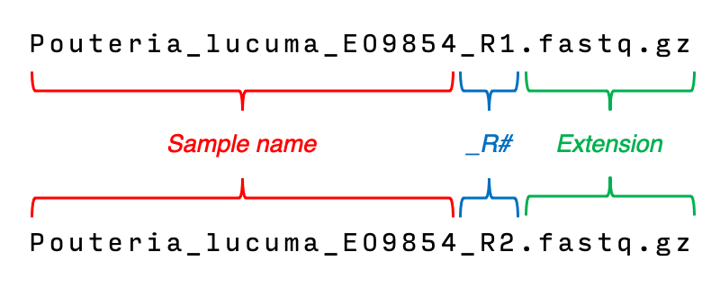

# Runing CAPTUS:

Let's make sure CAPTUS is installed:
```
conda activate captus
``` 

Help can be accessed by:
```
captus -h
```

## Imput prep

In general, a good tip for renaming your samples is to think on how you want the names in your final phylogenetic tree. If names are too long or subject to change, you can use codes that later can be replaced by names, but this requires some programming skills.

- The only special characters that are safe to use in the sample name are `-`, and `_` (`_` is commonly used to replace spaces in many phylogenetic programs).
- Do not use spaces or other special characters (e.g. ! " # $ % & ( ) * + , . / : ; < = > ? @ ] [ \ ^ { | } ~).
- Do not use double undescore `_` as CAPTUS uses them internally. 

The format used by CAPTUS looks like this:



- Any text found before the `_R#` pattern and the extension will become your sample name (`Pouteria_lucuma_EO9854` in this case).
If you are using paired-end reads, your R1 and R2 filenames should contain the patterns `_R1` and `_R2` respectively to be correctly matched and used as pairs.
- **importnat** For single-end your filenames should still contain `_R1`.
- These are the valid extensions: `.fq`, `.fastq`, `.fq.gz`, and `.fastq.gz`.

## Downloadinga data


